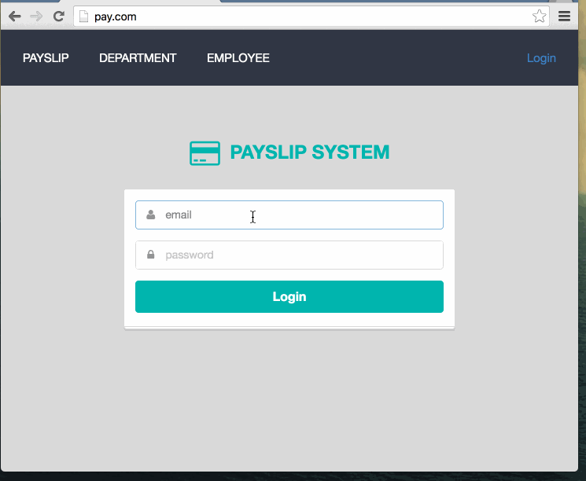
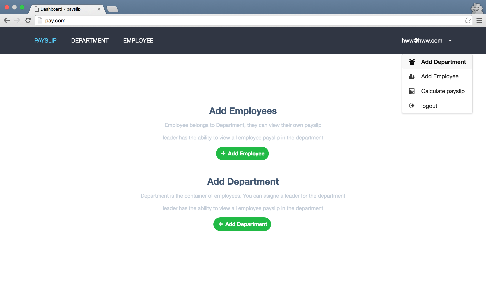
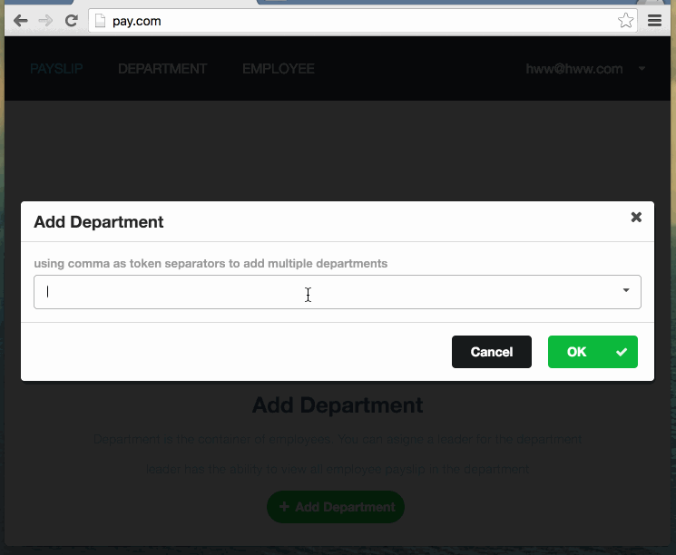
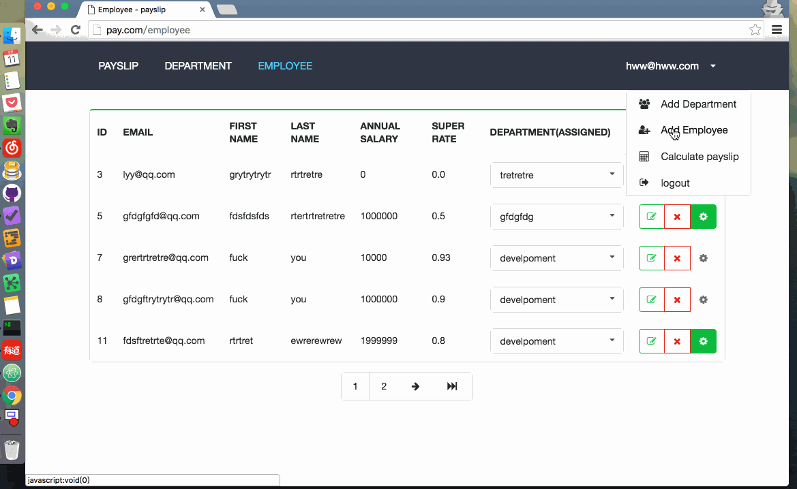

# PAYSLIP SYSTEM
需求文档在 [doc.md](./doc/doc.md) 文件中，只要是实现员工薪资计算功能。  
### Demo
[shubenhua.org](http://shubenhua.org/)
### 环境依赖
- Ruby > 2.2
- Rails 5.0.1
- Mysql
- Linux & UNIX

### 实现描述
有两大功能模块：用户系统和薪资计算模块  
#### 用户系统
其中用户系统使用了 [clearance](https://github.com/thoughtbot/clearance) 。系统初始化时生成一个系统管理员账号，用以新建员工账号（注册功能关闭，只有通过系统管理员才能新建账号）。  
  
系统管理员登录之后跳转到 Dashboard 页面，通过导航栏，可添加员工以及部门。  

#### 添加操作
- 添加部门(可同时添加多个部门)
  
- 添加成员(可同时指派到部门)
  

### 计算薪资


另外还有对成员以及部门的增删改查操作。可取消和设置某个用户为部门负责人。  

### 本地运行
```
git clone https://github.com/wenweih/payslip.git
cd payslip
gem install puma
bundle install
rake db:create
rake db:migrate
puma -C config/puma.rb
```
### 技术栈
####前端
[Semantic-UI](https://github.com/Semantic-Org/Semantic-UI) 框架为主体。充分利用框架的 validate, dropdown, modal 等组件
[turbolinks](https://github.com/turbolinks/turbolinks) 高效组织 Javascript 代码，此中结构适合或大或小的 Rails webApp 站点。
[wenweih/web-notification.js](https://github.com/wenweih/web-notification.js) 定制 flash message 现实插件。
### 后端
[Rails](https://github.com/rails/rails) 开发 Web MVC 框架  
[clearance](https://github.com/thoughtbot/clearance)作为用户系统，根据系统需要做了微量复写  
封装了薪资计算模块，放在 ```lib/payslip/payslip_calculate.rb```文件中  
### 接下来需要做的
1. 完善权限管理。系统管理员拥有最大权限,部门经理可插件所在部门全部的薪资；一般员工可查看自己的薪资明细.
